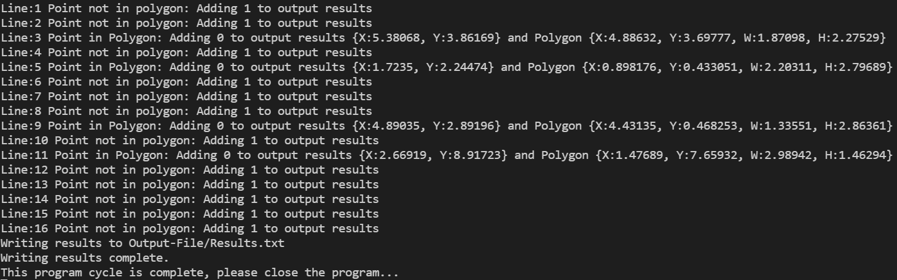

# Point in Polygon

## Information:
Created using Visual Studio Code & C++.

* Compiled app can be found in the `Release.7z` file in the root directory of the repo in case of any compilation or environment issues.
* To build this project, simply run a build cycle with cmake for your desired envrionment.

## Design Choices:

* In this project I decided to go with the winding number approach to determine whether a point is inside a polygon, thit is an algorithm can solve if a point is inside a polygon by counting if any vertices "wind" around the point.
* This is done by comparing the point to the polygon's vertices and determining where it lies with respect to the polygon boundaries. 
* Normally this involves some fairly expensive trigonometric calculations, leading many to favour the more classic ray casting method of sweeping a grid space and counting how many times the ray intersects with a polygon edge
* However, this was overcome by doing some research on newer techniques of computing this result meaning we only have to use the coordinates of the point and polygon itself, making the method just as efficient as the ray casting method and more accurate.
* The accuracy difference is caused by a quirk in the ray casting method, where if polygons wrap in on themselves the ray casting method can get the calculation wrong, the winding method calculates with reference to each polygon vertice so circumvents this and improves accuracy.
* Functionality specifics are documented in the classes themselves.

## Potential Improvements:
* The reading of the initial file should be able to be split into threads for huge files (this may make some gains)
* The inner loops in the actual calculations could be optimised through openMP on the CPU or openCL / cuda / SYCL on the GPU. It would have to be benchmarked but it seems likely that the best gains would be seen on the GPU since the calculations are fairly trivial
* Some additional improvments are probably possible through inlining functions as well
* Some templating of the read function / making the Polgyon class more generic to allow for future expansion of what kinds of Polygon it could be. This would pair nicely with the winding number algorithm approach.

## Requirements:
### Create a simple program in the language of your choice that meets the following requirements:
Functionality to:
- [x] Read input files
- [x] Determine whether the points lie inside any polgon
- [x] Generate an output file that, for each point, the output should be “0” if the ray intersects with a rectangle, or “1” if the ray can pass through.

## Image:

